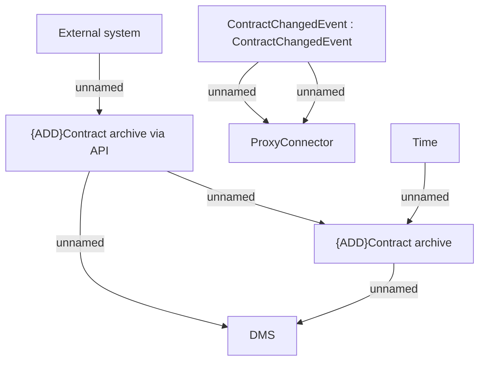

# Contract Archivation

```mermaid
graph TD
    External_system["External system"]
    Time["Time"]
    ProxyConnector["ProxyConnector"]
    ADD_Contract_archive_via_API["{ADD}Contract archive via API"]
    ProxyConnector["ProxyConnector"]
    DMS["DMS"]
    ContractChangedEvent_ContractChangedEvent["ContractChangedEvent : ContractChangedEvent"]
    ADD_Contract_archive["{ADD}Contract archive"]
    ADD_Contract_archive["{ADD}Contract archive"]
    ADD_Contract_archive_via_API -->|unnamed| ADD_Contract_archive
    ADD_Contract_archive_via_API -->|unnamed| DMS
    ADD_Contract_archive -->|unnamed| DMS
    ContractChangedEvent_ContractChangedEvent -->|unnamed| ProxyConnector
    ContractChangedEvent_ContractChangedEvent -->|unnamed| ProxyConnector
    External_system -->|unnamed| ADD_Contract_archive_via_API
    Time -->|unnamed| ADD_Contract_archive
```
