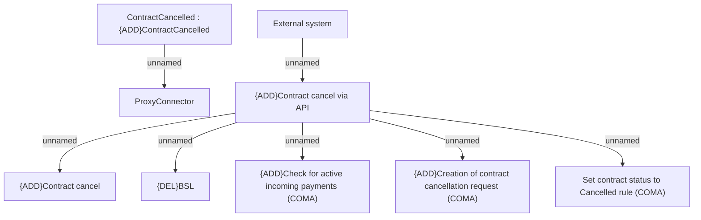

# Contract cancellation

```mermaid
graph TD
    External_system["External system"]
    Set_contract_status_to_Cancelled_rule_COMA["Set contract status to Cancelled rule (COMA)"]
    ADD_Creation_of_contract_cancellation_request_COMA["{ADD}Creation of contract cancellation request (COMA)"]
    ADD_Check_for_active_incoming_payments_COMA["{ADD}Check for active incoming payments (COMA)"]
    ProxyConnector["ProxyConnector"]
    ContractCancelled_ADD_ContractCancelled["ContractCancelled : {ADD}ContractCancelled"]
    DEL_BSL["{DEL}BSL"]
    ADD_Contract_cancel_via_API["{ADD}Contract cancel via API"]
    ADD_Contract_cancel["{ADD}Contract cancel"]
    ADD_Contract_cancel_via_API -->|unnamed| ADD_Contract_cancel
    ADD_Contract_cancel_via_API -->|unnamed| DEL_BSL
    ContractCancelled_ADD_ContractCancelled -->|unnamed| ProxyConnector
    ADD_Contract_cancel_via_API -->|unnamed| ADD_Check_for_active_incoming_payments_COMA
    ADD_Contract_cancel_via_API -->|unnamed| ADD_Creation_of_contract_cancellation_request_COMA
    ADD_Contract_cancel_via_API -->|unnamed| Set_contract_status_to_Cancelled_rule_COMA
    External_system -->|unnamed| ADD_Contract_cancel_via_API
```
