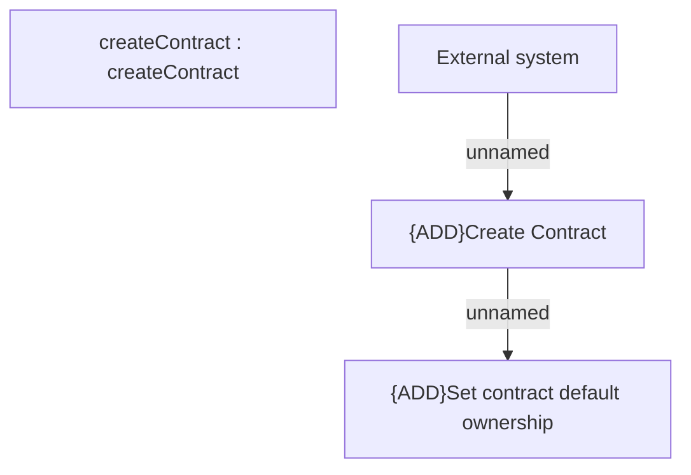

# Create Contract - Use Case Model

```mermaid
graph TD
    ADD_Set_contract_default_ownership["{ADD}Set contract default ownership"]
    createContract_createContract["createContract : createContract"]
    External_system["External system"]
    ADD_Create_Contract["{ADD}Create Contract"]
    ADD_Create_Contract -->|unnamed| ADD_Set_contract_default_ownership
    External_system -->|unnamed| ADD_Create_Contract
```
