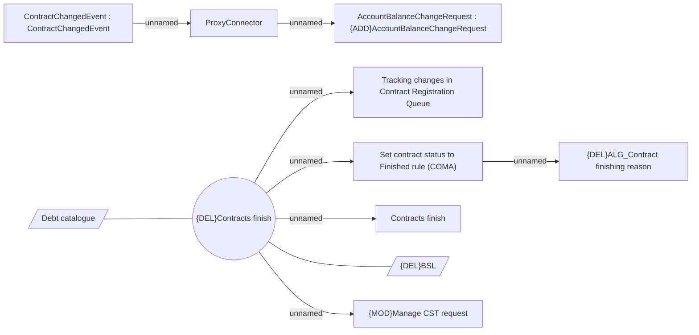

# Contracts finishing

- **Diagram Type**: Use Case
- **Package**: HomerSelect/BSL/Modules/Contract Management (COMA_NG)/Analytical Model/Contract Operations/Finish Contract/Use Case Model
- **Diagram ID**: 163125
- **Elements**: 12
- **Connectors**: 9

