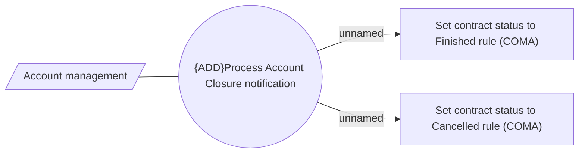

# Processing Account Closure notification - Use Case Model

- **Diagram Type**: Use Case
- **Package**: HomerSelect/BSL/Modules/Contract Management (COMA_NG)/Analytical Model/Contract Operations/Process account closure/Use Case Model
- **Diagram ID**: 163126
- **Elements**: 4
- **Connectors**: 3

