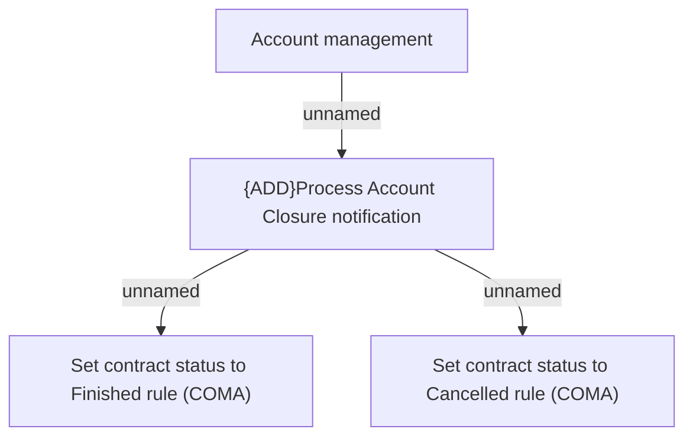

# Processing Account Closure notification - Use Case Model

```mermaid
graph TD
    Set_contract_status_to_Finished_rule_COMA["Set contract status to Finished rule (COMA)"]
    Account_management["Account management"]
    ADD_Process_Account_Closure_notification["{ADD}Process Account Closure notification"]
    Set_contract_status_to_Cancelled_rule_COMA["Set contract status to Cancelled rule (COMA)"]
    ADD_Process_Account_Closure_notification -->|unnamed| Set_contract_status_to_Finished_rule_COMA
    ADD_Process_Account_Closure_notification -->|unnamed| Set_contract_status_to_Cancelled_rule_COMA
    Account_management -->|unnamed| ADD_Process_Account_Closure_notification
```
