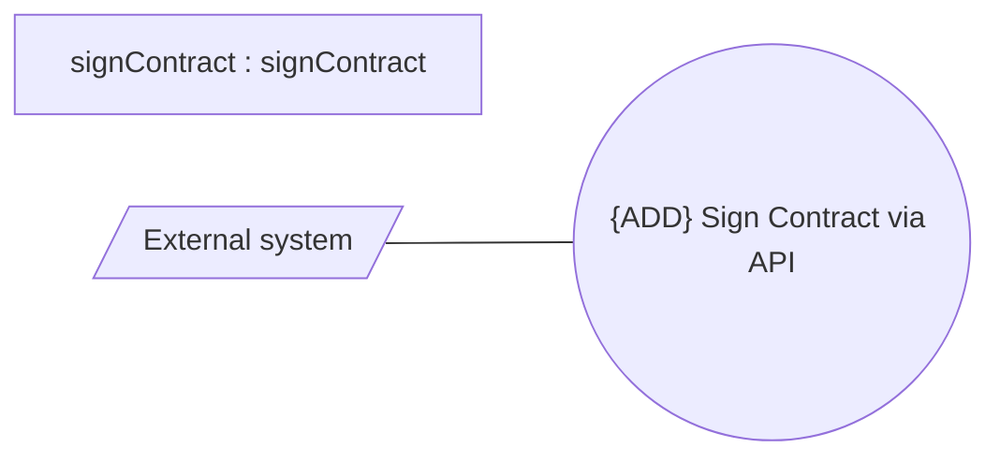

# Use Case Model

- **Diagram Type**: Use Case
- **Package**: HomerSelect/BSL/Modules/Contract Management (COMA_NG)/Analytical Model/Contract Operations/Sign Contract/Use Case Model
- **Diagram ID**: 160759
- **Elements**: 3
- **Connectors**: 1

