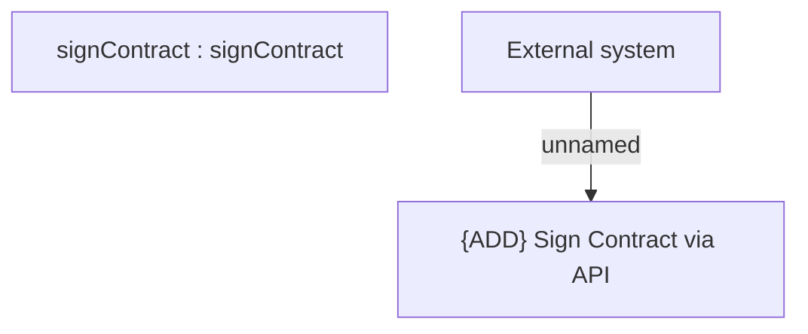

# Use Case Model

```mermaid
graph TD
    signContract_signContract["signContract : signContract"]
    External_system["External system"]
    ADD_Sign_Contract_via_API["{ADD} Sign Contract via API"]
    External_system -->|unnamed| ADD_Sign_Contract_via_API
```
