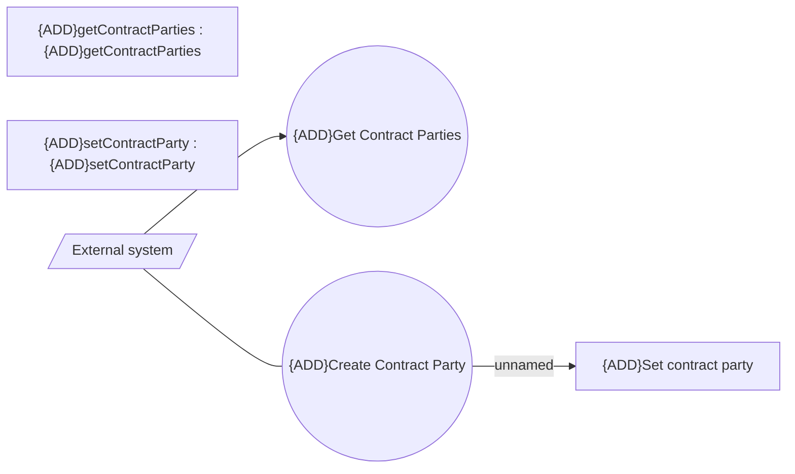

# Manage Contract Parties - Use case model

- **Diagram Type**: Use Case
- **Package**: HomerSelect/BSL/Modules/Contract Management (COMA_NG)/Analytical Model/Contract Operations/{ADD}Contract Parties/Use Case Model
- **Diagram ID**: 160663
- **Elements**: 6
- **Connectors**: 3

