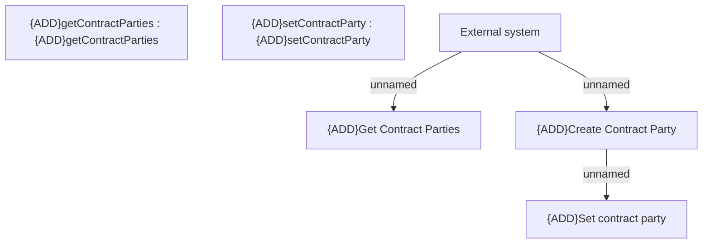

# Manage Contract Parties - Use case model

```mermaid
graph TD
    ADD_getContractParties_ADD_getContractParties["{ADD}getContractParties : {ADD}getContractParties"]
    ADD_Get_Contract_Parties["{ADD}Get Contract Parties"]
    ADD_Set_contract_party["{ADD}Set contract party"]
    ADD_setContractParty_ADD_setContractParty["{ADD}setContractParty : {ADD}setContractParty"]
    ADD_Create_Contract_Party["{ADD}Create Contract Party"]
    External_system["External system"]
    ADD_Create_Contract_Party -->|unnamed| ADD_Set_contract_party
    External_system -->|unnamed| ADD_Get_Contract_Parties
    External_system -->|unnamed| ADD_Create_Contract_Party
```
