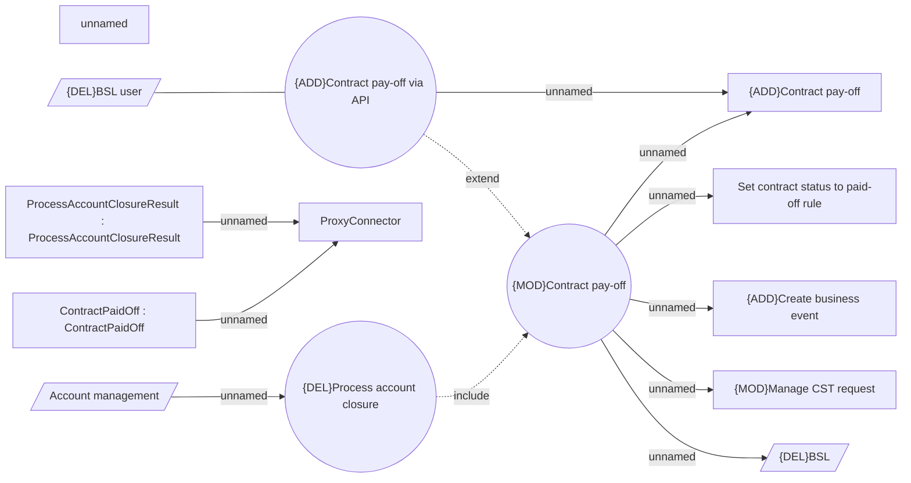

# Contract pay-off

- **Diagram Type**: Use Case
- **Package**: HomerSelect/BSL/Modules/Contract Management (COMA_NG)/Analytical Model/Contract Operations/{DEL}Pay-off Contract/Use Case Model
- **Diagram ID**: 160618
- **Elements**: 15
- **Connectors**: 12

