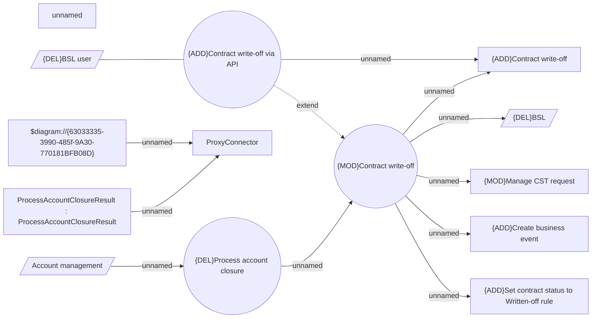

# Contract write-off

- **Diagram Type**: Use Case
- **Package**: HomerSelect/BSL/Modules/Contract Management (COMA_NG)/Analytical Model/Contract Operations/{DEL}Write-off Contract/Use Case Model
- **Diagram ID**: 160619
- **Elements**: 15
- **Connectors**: 12

