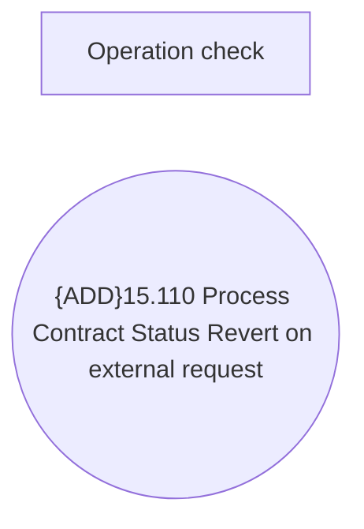

# Contract Status Revert on external request

- **Diagram Type**: Use Case
- **Package**: HomerSelect/BSL/Modules/Contract Management (COMA_NG)/Analytical Model/Contracts Maintenance/Contract Status Revert/Use Case Model
- **Diagram ID**: 160208
- **Elements**: 2
- **Connectors**: 0

