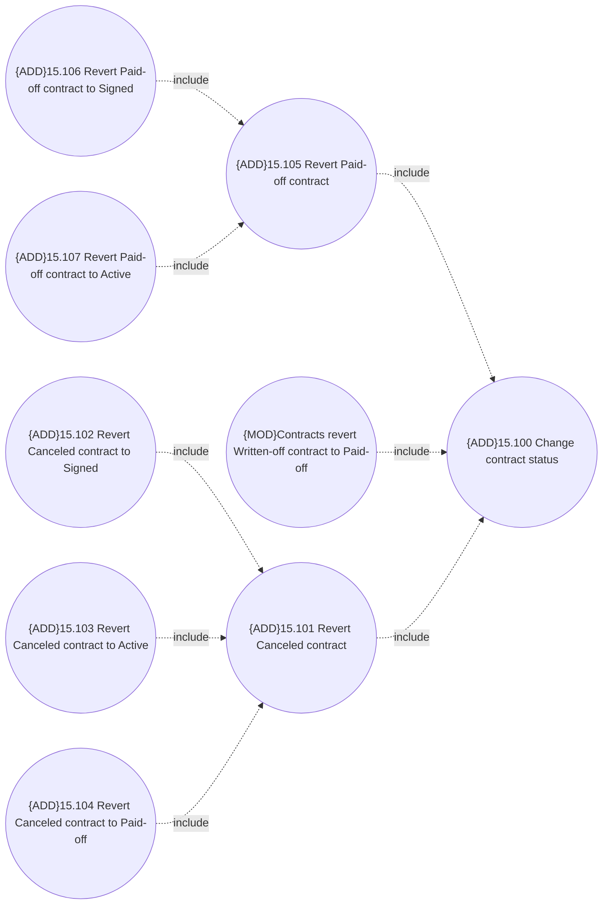

# Contract Status Revert

- **Diagram Type**: Use Case
- **Package**: HomerSelect/BSL/Modules/Contract Management (COMA_NG)/Analytical Model/Contracts Maintenance/Contract Status Revert/Use Case Model
- **Diagram ID**: 160207
- **Elements**: 9
- **Connectors**: 8

