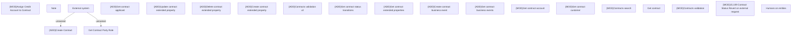

# Use Cases

```mermaid
graph TD
    MOD_Assign_Credit_Account_to_Contract["{MOD}Assign Credit Account to Contract"]
    el_1868491["Note"]
    ADD_Create_Contract["{ADD}Create Contract"]
    Get_Contract_Party_Role["Get Contract Party Role"]
    External_system["External system"]
    ADD_Get_contract_applicant["{ADD}Get contract applicant"]
    ADD_Update_contract_extended_property["{ADD}Update contract extended property"]
    ADD_Delete_contract_extended_property["{ADD}Delete contract extended property"]
    ADD_Create_contract_extended_property["{ADD}Create contract extended property"]
    ADD_Contracts_validation_v2["{ADD}Contracts validation v2"]
    ADD_Get_contract_status_transitions["{ADD}Get contract status transitions"]
    ADD_Get_contract_extended_properties["{ADD}Get contract extended properties"]
    ADD_Create_contract_business_event["{ADD}Create contract business event"]
    ADD_Get_contract_business_events["{ADD}Get contract business events"]
    MOD_Get_contract_account["{MOD}Get contract account"]
    MOD_Get_contract_customer["{MOD}Get contract customer"]
    MOD_Contracts_search["{MOD}Contracts search"]
    Get_contract["Get contract"]
    MOD_Contracts_validation["{MOD}Contracts validation"]
    MOD_15_109_Contract_Status_Revert_on_external_request["{MOD}15.109 Contract Status Revert on external request"]
    Humans_on_entities["Humans on entities"]
    External_system -->|unnamed| ADD_Create_Contract
    External_system -->|unnamed| Get_Contract_Party_Role
```
