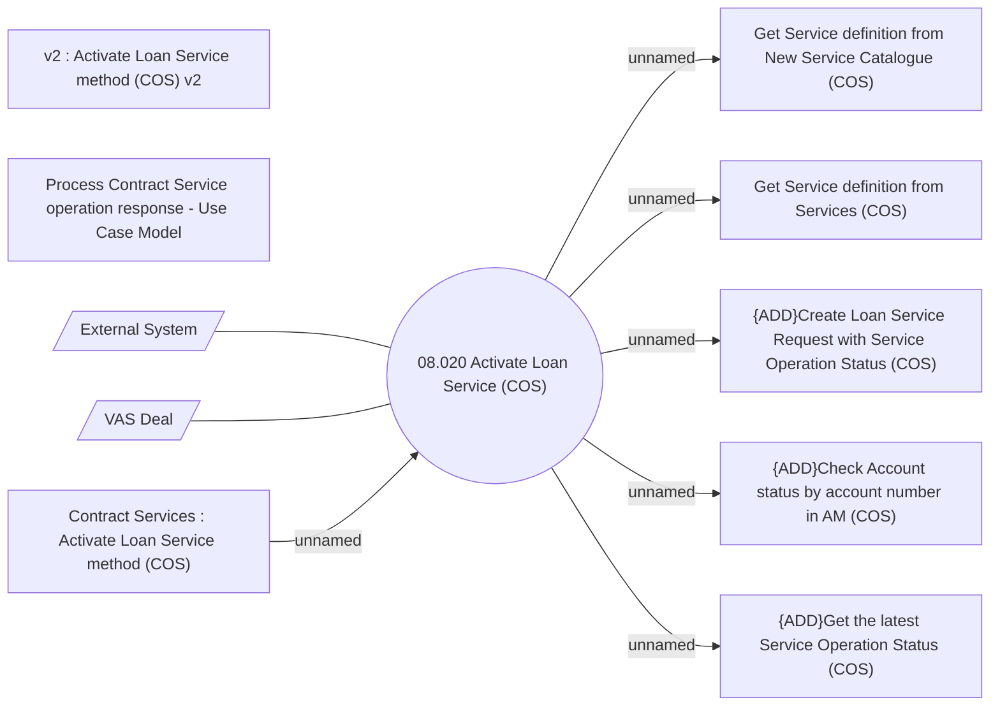

# Activate Service on Contract - Use Case Model

- **Diagram Type**: Use Case
- **Package**: HomerSelect/BSL/Modules/Contract Services (COS)/Analytical Model/Use Case Model
- **Diagram ID**: 163695
- **Elements**: 11
- **Connectors**: 8

