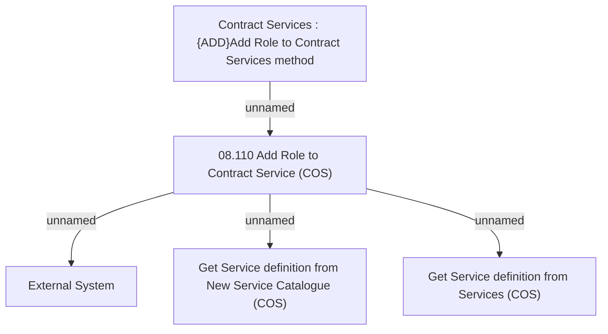

# Add Role to Contract Service - Use Case Model

```mermaid
graph TD
    Get_Service_definition_from_Services_COS["Get Service definition from Services (COS)"]
    Get_Service_definition_from_New_Service_Catalogue_COS["Get Service definition from New Service Catalogue (COS)"]
    Contract_Services_ADD_Add_Role_to_Contract_Services_method["Contract Services : {ADD}Add Role to Contract Services method"]
    External_System["External System"]
    n_08_110_Add_Role_to_Contract_Service_COS["08.110 Add Role to Contract Service (COS)"]
    Contract_Services_ADD_Add_Role_to_Contract_Services_method -->|unnamed| n_08_110_Add_Role_to_Contract_Service_COS
    n_08_110_Add_Role_to_Contract_Service_COS -->|unnamed| External_System
    n_08_110_Add_Role_to_Contract_Service_COS -->|unnamed| Get_Service_definition_from_New_Service_Catalogue_COS
    n_08_110_Add_Role_to_Contract_Service_COS -->|unnamed| Get_Service_definition_from_Services_COS
```
