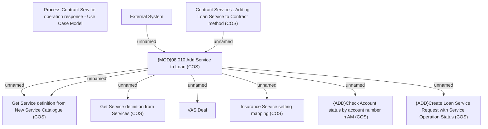

# Adding Service to Contract - Use Case Model

```mermaid
graph TD
    Process_Contract_Service_operation_response_Use_Case_Model["Process Contract Service operation response - Use Case Model"]
    ADD_Create_Loan_Service_Request_with_Service_Operation_Statu["{ADD}Create Loan Service Request with Service Operation Status (COS)"]
    ADD_Check_Account_status_by_account_number_in_AM_COS["{ADD}Check Account status by account number in AM (COS)"]
    Insurance_Service_setting_mapping_COS["Insurance Service setting mapping (COS)"]
    VAS_Deal["VAS Deal"]
    Contract_Services_Adding_Loan_Service_to_Contract_method_COS["Contract Services : Adding Loan Service to Contract method (COS)"]
    Get_Service_definition_from_Services_COS["Get Service definition from Services (COS)"]
    Get_Service_definition_from_New_Service_Catalogue_COS["Get Service definition from New Service Catalogue (COS)"]
    External_System["External System"]
    MOD_08_010_Add_Service_to_Loan_COS["{MOD}08.010 Add Service to Loan (COS)"]
    External_System -->|unnamed| MOD_08_010_Add_Service_to_Loan_COS
    Contract_Services_Adding_Loan_Service_to_Contract_method_COS -->|unnamed| MOD_08_010_Add_Service_to_Loan_COS
    MOD_08_010_Add_Service_to_Loan_COS -->|unnamed| Get_Service_definition_from_New_Service_Catalogue_COS
    MOD_08_010_Add_Service_to_Loan_COS -->|unnamed| Get_Service_definition_from_New_Service_Catalogue_COS
    MOD_08_010_Add_Service_to_Loan_COS -->|unnamed| Get_Service_definition_from_Services_COS
    MOD_08_010_Add_Service_to_Loan_COS -->|unnamed| VAS_Deal
    MOD_08_010_Add_Service_to_Loan_COS -->|unnamed| Insurance_Service_setting_mapping_COS
    MOD_08_010_Add_Service_to_Loan_COS -->|unnamed| ADD_Check_Account_status_by_account_number_in_AM_COS
    MOD_08_010_Add_Service_to_Loan_COS -->|unnamed| ADD_Create_Loan_Service_Request_with_Service_Operation_Statu
```
