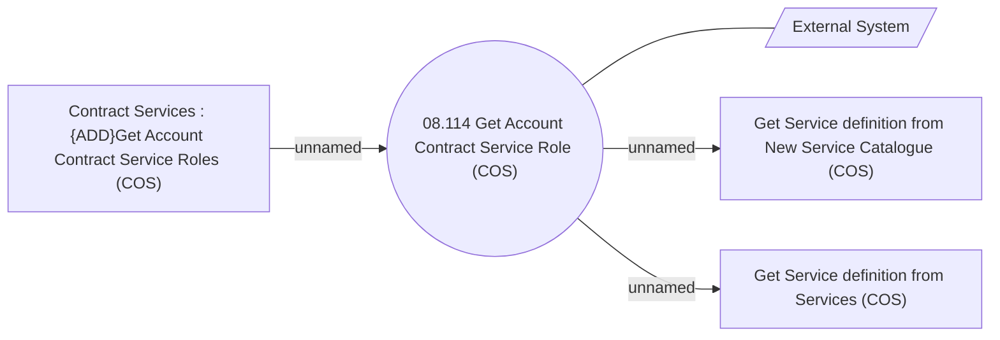

# Get Account Contract Service Role - Use Case Model

- **Diagram Type**: Use Case
- **Package**: HomerSelect/BSL/Modules/Contract Services (COS)/Analytical Model/Use Case Model
- **Diagram ID**: 163706
- **Elements**: 5
- **Connectors**: 4

