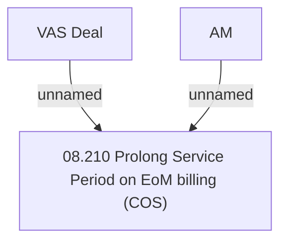

# Prolong Service Period on External event - Use Case Model

```mermaid
graph TD
    n_08_210_Prolong_Service_Period_on_EoM_billing_COS["08.210 Prolong Service Period on EoM billing (COS)"]
    VAS_Deal["VAS Deal"]
    AM["AM"]
    VAS_Deal -->|unnamed| n_08_210_Prolong_Service_Period_on_EoM_billing_COS
    AM -->|unnamed| n_08_210_Prolong_Service_Period_on_EoM_billing_COS
```
