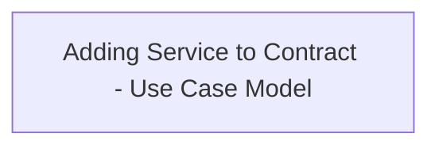

# CSI-2970 Add Service to Contract

- **Diagram Type**: Use Case
- **Package**: HomerSelect/BSL/Modules/Contract Services (COS)/Requirement Model/CBL-22680 Service Management Modules for REL/CSI-2970 Add Service to Contract
- **Diagram ID**: 155028
- **Elements**: 1
- **Connectors**: 0

