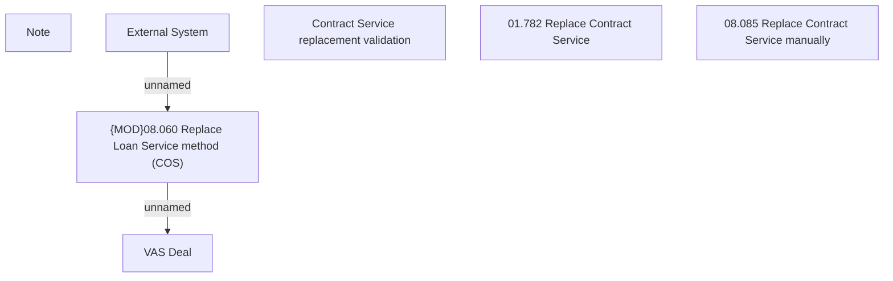

# CSI-2973 Replace Service on Contract

```mermaid
graph TD
    el_1795354["Note"]
    VAS_Deal["VAS Deal"]
    External_System["External System"]
    MOD_08_060_Replace_Loan_Service_method_COS["{MOD}08.060 Replace Loan Service method (COS)"]
    Contract_Service_replacement_validation["Contract Service replacement validation"]
    n_01_782_Replace_Contract_Service["01.782 Replace Contract Service"]
    n_08_085_Replace_Contract_Service_manually["08.085 Replace Contract Service manually"]
    External_System -->|unnamed| MOD_08_060_Replace_Loan_Service_method_COS
    MOD_08_060_Replace_Loan_Service_method_COS -->|unnamed| VAS_Deal
```
