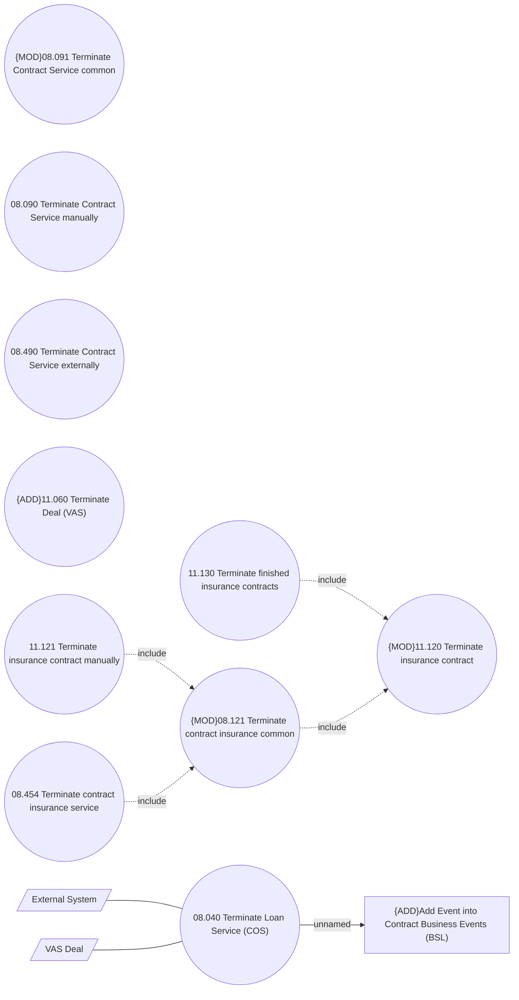

# CSI-2974 Terminate Service on Contract

- **Diagram Type**: Use Case
- **Package**: HomerSelect/BSL/Modules/Contract Services (COS)/Requirement Model/CBL-22680 Service Management Modules for REL/CSI-2974 Terminate Service on Contract
- **Diagram ID**: 155403
- **Elements**: 13
- **Connectors**: 7

