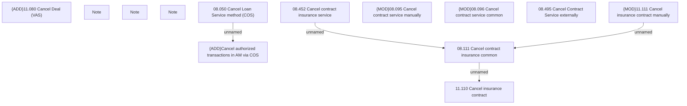

# CSI-2975 COS - Cancel Service on Contract

```mermaid
graph TD
    ADD_Cancel_authorized_transactions_in_AM_via_COS["{ADD}Cancel authorized transactions in AM via COS"]
    ADD_11_080_Cancel_Deal_VAS["{ADD}11.080 Cancel Deal (VAS)"]
    el_1794559["Note"]
    el_1794560["Note"]
    el_1794558["Note"]
    n_11_110_Cancel_insurance_contract["11.110 Cancel insurance contract"]
    MOD_11_111_Cancel_insurance_contract_manually["{MOD}11.111 Cancel insurance contract manually"]
    n_08_111_Cancel_contract_insurance_common["08.111 Cancel contract insurance common"]
    n_08_452_Cancel_contract_insurance_service["08.452 Cancel contract insurance service"]
    MOD_08_095_Cancel_contract_service_manually["{MOD}08.095 Cancel contract service manually"]
    MOD_08_096_Cancel_contract_service_common["{MOD}08.096 Cancel contract service common"]
    n_08_495_Cancel_Contract_Service_externally["08.495 Cancel Contract Service externally"]
    n_08_050_Cancel_Loan_Service_method_COS["08.050 Cancel Loan Service method (COS)"]
    n_08_050_Cancel_Loan_Service_method_COS -->|unnamed| ADD_Cancel_authorized_transactions_in_AM_via_COS
    n_08_452_Cancel_contract_insurance_service -->|unnamed| n_08_111_Cancel_contract_insurance_common
    n_08_111_Cancel_contract_insurance_common -->|unnamed| n_11_110_Cancel_insurance_contract
    MOD_11_111_Cancel_insurance_contract_manually -->|unnamed| n_08_111_Cancel_contract_insurance_common
```
