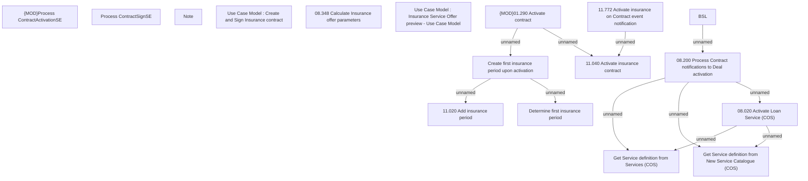

# CSI-2977 COS - Process Contract notifications to Deal activation

```mermaid
graph TD
    Get_Service_definition_from_Services_COS["Get Service definition from Services (COS)"]
    Get_Service_definition_from_New_Service_Catalogue_COS["Get Service definition from New Service Catalogue (COS)"]
    MOD_Process_ContractActivationSE["{MOD}Process ContractActivationSE"]
    Process_ContractSignSE["Process ContractSignSE"]
    el_1795360["Note"]
    Use_Case_Model_Create_and_Sign_Insurance_contract["Use Case Model : Create and Sign Insurance contract"]
    n_08_348_Calculate_Insurance_offer_parameters["08.348 Calculate Insurance offer parameters"]
    Use_Case_Model_Insurance_Service_Offer_preview_Use_Case_Mode["Use Case Model : Insurance Service Offer preview - Use Case Model"]
    Determine_first_insurance_period["Determine first insurance period"]
    MOD_01_290_Activate_contract["{MOD}01.290 Activate contract"]
    n_11_040_Activate_insurance_contract["11.040 Activate insurance contract"]
    n_11_020_Add_insurance_period["11.020 Add insurance period"]
    Create_first_insurance_period_upon_activation["Create first insurance period upon activation"]
    n_11_772_Activate_insurance_on_Contract_event_notification["11.772 Activate insurance on Contract event notification"]
    n_08_020_Activate_Loan_Service_COS["08.020 Activate Loan Service (COS)"]
    BSL["BSL"]
    n_08_200_Process_Contract_notifications_to_Deal_activation["08.200 Process Contract notifications to Deal activation"]
    BSL -->|unnamed| n_08_200_Process_Contract_notifications_to_Deal_activation
    n_08_200_Process_Contract_notifications_to_Deal_activation -->|unnamed| Get_Service_definition_from_Services_COS
    n_08_200_Process_Contract_notifications_to_Deal_activation -->|unnamed| Get_Service_definition_from_New_Service_Catalogue_COS
    n_08_200_Process_Contract_notifications_to_Deal_activation -->|unnamed| n_08_020_Activate_Loan_Service_COS
    n_08_020_Activate_Loan_Service_COS -->|unnamed| Get_Service_definition_from_Services_COS
    n_08_020_Activate_Loan_Service_COS -->|unnamed| Get_Service_definition_from_New_Service_Catalogue_COS
    MOD_01_290_Activate_contract -->|unnamed| Create_first_insurance_period_upon_activation
    MOD_01_290_Activate_contract -->|unnamed| n_11_040_Activate_insurance_contract
    Create_first_insurance_period_upon_activation -->|unnamed| n_11_020_Add_insurance_period
    Create_first_insurance_period_upon_activation -->|unnamed| Determine_first_insurance_period
    n_11_772_Activate_insurance_on_Contract_event_notification -->|unnamed| n_11_040_Activate_insurance_contract
```
