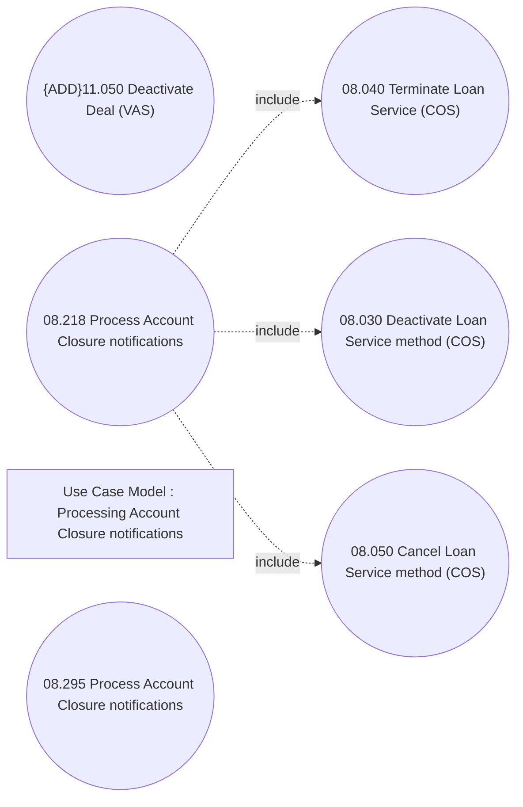

# CSI-2978 Process Account Closure notification

- **Diagram Type**: Use Case
- **Package**: HomerSelect/BSL/Modules/Contract Services (COS)/Requirement Model/CBL-22680 Service Management Modules for REL/CSI-2978 Process Account Closure notification
- **Diagram ID**: 155686
- **Elements**: 7
- **Connectors**: 3

