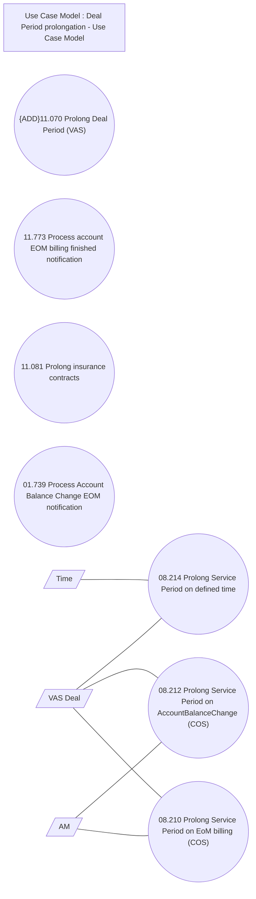

# CSI-2979 Process Account EoM billing notification

- **Diagram Type**: Use Case
- **Package**: HomerSelect/BSL/Modules/Contract Services (COS)/Requirement Model/CBL-22680 Service Management Modules for REL/CSI-2979 Process Account EoM billing notification
- **Diagram ID**: 155766
- **Elements**: 11
- **Connectors**: 6

