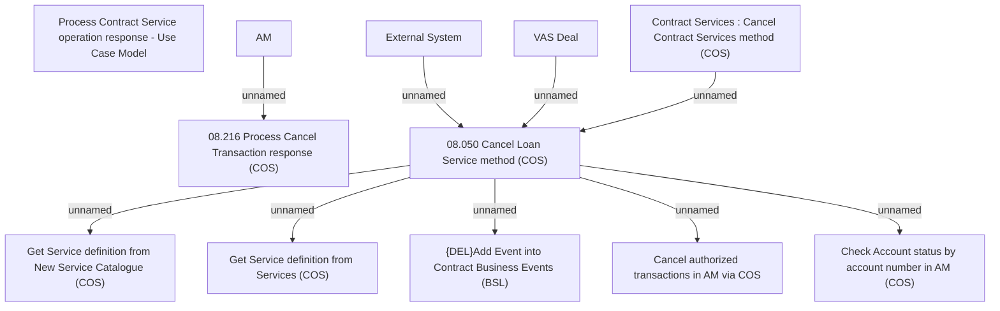

# Cancel Loan Service - Use Case Model

```mermaid
graph TD
    Check_Account_status_by_account_number_in_AM_COS["Check Account status by account number in AM (COS)"]
    Process_Contract_Service_operation_response_Use_Case_Model["Process Contract Service operation response - Use Case Model"]
    AM["AM"]
    n_08_216_Process_Cancel_Transaction_response_COS["08.216 Process Cancel Transaction response (COS)"]
    Cancel_authorized_transactions_in_AM_via_COS["Cancel authorized transactions in AM via COS"]
    DEL_Add_Event_into_Contract_Business_Events_BSL["{DEL}Add Event into Contract Business Events (BSL)"]
    Get_Service_definition_from_Services_COS["Get Service definition from Services (COS)"]
    Get_Service_definition_from_New_Service_Catalogue_COS["Get Service definition from New Service Catalogue (COS)"]
    Contract_Services_Cancel_Contract_Services_method_COS["Contract Services : Cancel Contract Services method (COS)"]
    VAS_Deal["VAS Deal"]
    External_System["External System"]
    n_08_050_Cancel_Loan_Service_method_COS["08.050 Cancel Loan Service method (COS)"]
    External_System -->|unnamed| n_08_050_Cancel_Loan_Service_method_COS
    VAS_Deal -->|unnamed| n_08_050_Cancel_Loan_Service_method_COS
    Contract_Services_Cancel_Contract_Services_method_COS -->|unnamed| n_08_050_Cancel_Loan_Service_method_COS
    n_08_050_Cancel_Loan_Service_method_COS -->|unnamed| Get_Service_definition_from_New_Service_Catalogue_COS
    n_08_050_Cancel_Loan_Service_method_COS -->|unnamed| Get_Service_definition_from_Services_COS
    n_08_050_Cancel_Loan_Service_method_COS -->|unnamed| DEL_Add_Event_into_Contract_Business_Events_BSL
    n_08_050_Cancel_Loan_Service_method_COS -->|unnamed| Cancel_authorized_transactions_in_AM_via_COS
    AM -->|unnamed| n_08_216_Process_Cancel_Transaction_response_COS
    n_08_050_Cancel_Loan_Service_method_COS -->|unnamed| Check_Account_status_by_account_number_in_AM_COS
```
