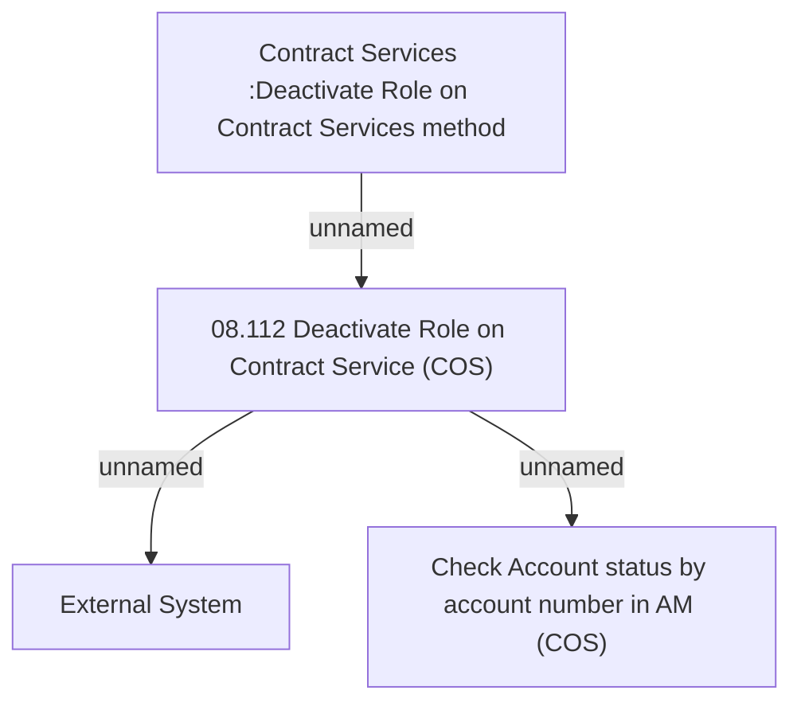

# Deactivate Role on Contract Service - Use Case Model

```mermaid
graph TD
    Check_Account_status_by_account_number_in_AM_COS["Check Account status by account number in AM (COS)"]
    Contract_Services_Deactivate_Role_on_Contract_Services_metho["Contract Services :Deactivate Role on Contract Services method"]
    External_System["External System"]
    n_08_112_Deactivate_Role_on_Contract_Service_COS["08.112 Deactivate Role on Contract Service (COS)"]
    Contract_Services_Deactivate_Role_on_Contract_Services_metho -->|unnamed| n_08_112_Deactivate_Role_on_Contract_Service_COS
    n_08_112_Deactivate_Role_on_Contract_Service_COS -->|unnamed| External_System
    n_08_112_Deactivate_Role_on_Contract_Service_COS -->|unnamed| Check_Account_status_by_account_number_in_AM_COS
```
