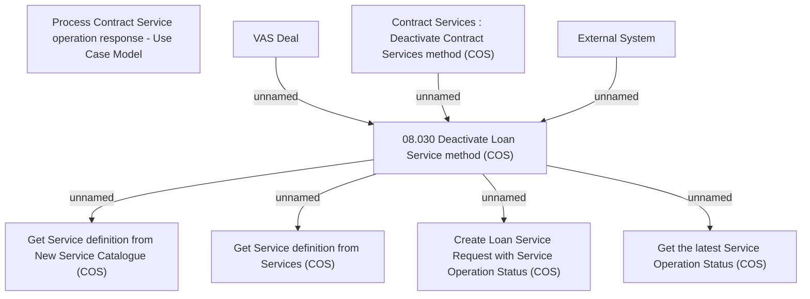

# Deactivate Service on Contract - Use Case Model

```mermaid
graph TD
    Process_Contract_Service_operation_response_Use_Case_Model["Process Contract Service operation response - Use Case Model"]
    Get_the_latest_Service_Operation_Status_COS["Get the latest Service Operation Status (COS)"]
    Create_Loan_Service_Request_with_Service_Operation_Status_CO["Create Loan Service Request with Service Operation Status (COS)"]
    Get_Service_definition_from_Services_COS["Get Service definition from Services (COS)"]
    Get_Service_definition_from_New_Service_Catalogue_COS["Get Service definition from New Service Catalogue (COS)"]
    Contract_Services_Deactivate_Contract_Services_method_COS["Contract Services : Deactivate Contract Services method (COS)"]
    VAS_Deal["VAS Deal"]
    External_System["External System"]
    n_08_030_Deactivate_Loan_Service_method_COS["08.030 Deactivate Loan Service method (COS)"]
    VAS_Deal -->|unnamed| n_08_030_Deactivate_Loan_Service_method_COS
    Contract_Services_Deactivate_Contract_Services_method_COS -->|unnamed| n_08_030_Deactivate_Loan_Service_method_COS
    External_System -->|unnamed| n_08_030_Deactivate_Loan_Service_method_COS
    n_08_030_Deactivate_Loan_Service_method_COS -->|unnamed| Get_Service_definition_from_New_Service_Catalogue_COS
    n_08_030_Deactivate_Loan_Service_method_COS -->|unnamed| Get_Service_definition_from_Services_COS
    n_08_030_Deactivate_Loan_Service_method_COS -->|unnamed| Create_Loan_Service_Request_with_Service_Operation_Status_CO
    n_08_030_Deactivate_Loan_Service_method_COS -->|unnamed| Get_the_latest_Service_Operation_Status_COS
```
