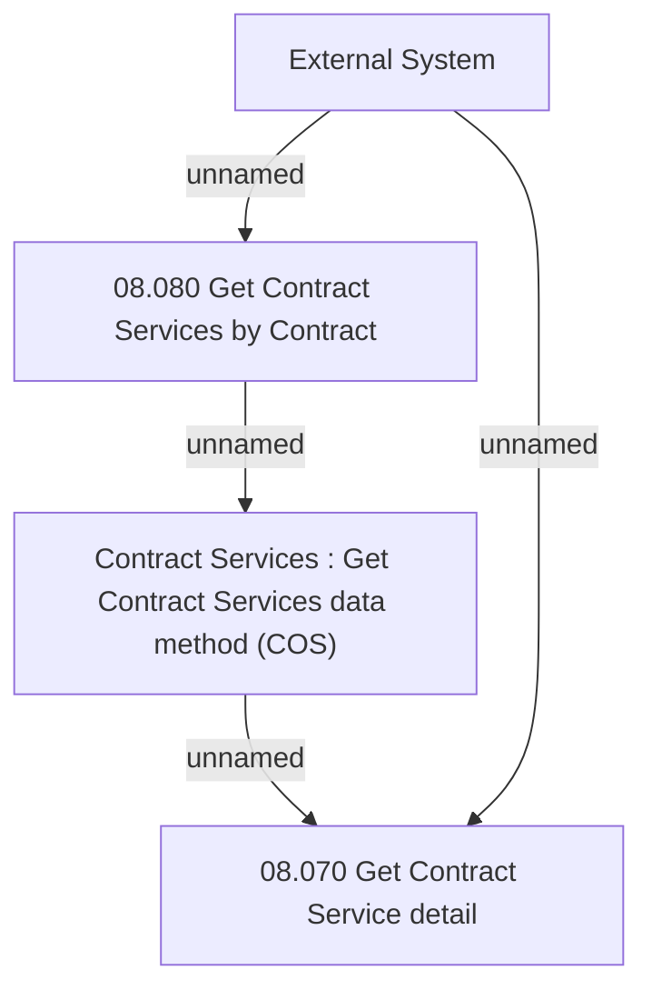

# Get Contract Service detail - Use Case Model

```mermaid
graph TD
    n_08_080_Get_Contract_Services_by_Contract["08.080 Get Contract Services by Contract"]
    Contract_Services_Get_Contract_Services_data_method_COS["Contract Services : Get Contract Services data method (COS)"]
    External_System["External System"]
    n_08_070_Get_Contract_Service_detail["08.070 Get Contract Service detail"]
    Contract_Services_Get_Contract_Services_data_method_COS -->|unnamed| n_08_070_Get_Contract_Service_detail
    External_System -->|unnamed| n_08_070_Get_Contract_Service_detail
    n_08_080_Get_Contract_Services_by_Contract -->|unnamed| Contract_Services_Get_Contract_Services_data_method_COS
    External_System -->|unnamed| n_08_080_Get_Contract_Services_by_Contract
```
