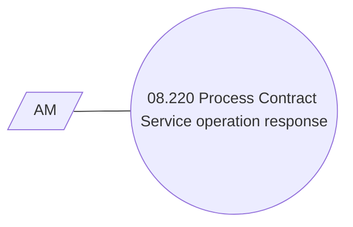

# Process Contract Service operation response - Use Case Model

- **Diagram Type**: Use Case
- **Package**: HomerSelect/BSL/Modules/Contract Services (COS_NG)/Analytical Model/Use Case Model
- **Diagram ID**: 164141
- **Elements**: 2
- **Connectors**: 1

