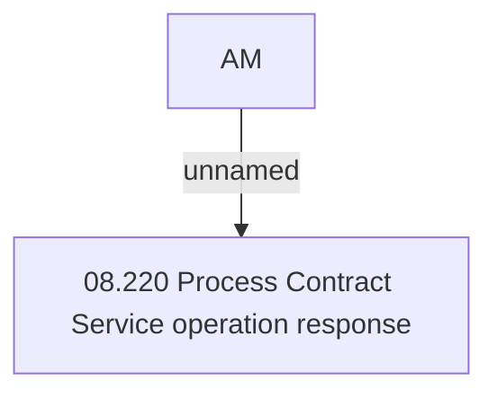

# Process Contract Service operation response - Use Case Model

```mermaid
graph TD
    AM["AM"]
    n_08_220_Process_Contract_Service_operation_response["08.220 Process Contract Service operation response"]
    AM -->|unnamed| n_08_220_Process_Contract_Service_operation_response
```
