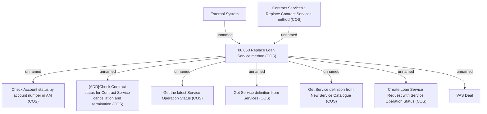

# Replace Loan Service - Use Case Model

```mermaid
graph TD
    VAS_Deal["VAS Deal"]
    Create_Loan_Service_Request_with_Service_Operation_Status_CO["Create Loan Service Request with Service Operation Status (COS)"]
    Get_Service_definition_from_New_Service_Catalogue_COS["Get Service definition from New Service Catalogue (COS)"]
    Get_Service_definition_from_Services_COS["Get Service definition from Services (COS)"]
    Get_the_latest_Service_Operation_Status_COS["Get the latest Service Operation Status (COS)"]
    ADD_Check_Contract_status_for_Contract_Service_cancellation_["{ADD}Check Contract status for Contract Service cancellation and termination (COS)"]
    Check_Account_status_by_account_number_in_AM_COS["Check Account status by account number in AM (COS)"]
    Contract_Services_Replace_Contract_Services_method_COS["Contract Services : Replace Contract Services method (COS)"]
    External_System["External System"]
    n_08_060_Replace_Loan_Service_method_COS["08.060 Replace Loan Service method (COS)"]
    External_System -->|unnamed| n_08_060_Replace_Loan_Service_method_COS
    Contract_Services_Replace_Contract_Services_method_COS -->|unnamed| n_08_060_Replace_Loan_Service_method_COS
    n_08_060_Replace_Loan_Service_method_COS -->|unnamed| Check_Account_status_by_account_number_in_AM_COS
    n_08_060_Replace_Loan_Service_method_COS -->|unnamed| ADD_Check_Contract_status_for_Contract_Service_cancellation_
    n_08_060_Replace_Loan_Service_method_COS -->|unnamed| Get_the_latest_Service_Operation_Status_COS
    n_08_060_Replace_Loan_Service_method_COS -->|unnamed| Get_Service_definition_from_Services_COS
    n_08_060_Replace_Loan_Service_method_COS -->|unnamed| Get_Service_definition_from_New_Service_Catalogue_COS
    n_08_060_Replace_Loan_Service_method_COS -->|unnamed| Create_Loan_Service_Request_with_Service_Operation_Status_CO
    n_08_060_Replace_Loan_Service_method_COS -->|unnamed| VAS_Deal
```
