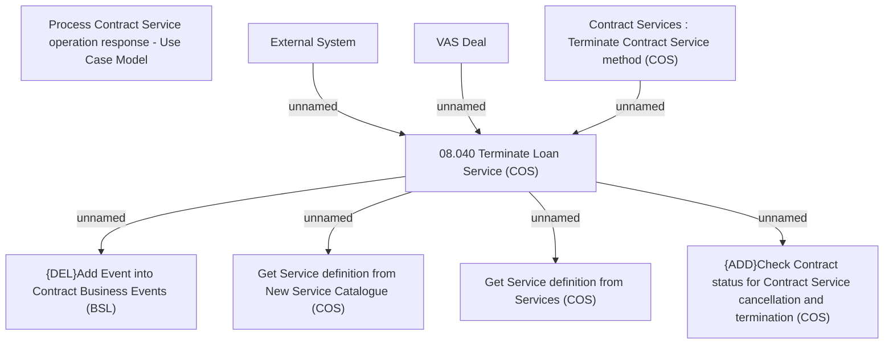

# Terminate Service on Contract - Use Case Model

```mermaid
graph TD
    Process_Contract_Service_operation_response_Use_Case_Model["Process Contract Service operation response - Use Case Model"]
    ADD_Check_Contract_status_for_Contract_Service_cancellation_["{ADD}Check Contract status for Contract Service cancellation and termination (COS)"]
    Get_Service_definition_from_Services_COS["Get Service definition from Services (COS)"]
    Get_Service_definition_from_New_Service_Catalogue_COS["Get Service definition from New Service Catalogue (COS)"]
    Contract_Services_Terminate_Contract_Service_method_COS["Contract Services : Terminate Contract Service method (COS)"]
    DEL_Add_Event_into_Contract_Business_Events_BSL["{DEL}Add Event into Contract Business Events (BSL)"]
    VAS_Deal["VAS Deal"]
    External_System["External System"]
    n_08_040_Terminate_Loan_Service_COS["08.040 Terminate Loan Service (COS)"]
    External_System -->|unnamed| n_08_040_Terminate_Loan_Service_COS
    VAS_Deal -->|unnamed| n_08_040_Terminate_Loan_Service_COS
    Contract_Services_Terminate_Contract_Service_method_COS -->|unnamed| n_08_040_Terminate_Loan_Service_COS
    n_08_040_Terminate_Loan_Service_COS -->|unnamed| DEL_Add_Event_into_Contract_Business_Events_BSL
    n_08_040_Terminate_Loan_Service_COS -->|unnamed| Get_Service_definition_from_New_Service_Catalogue_COS
    n_08_040_Terminate_Loan_Service_COS -->|unnamed| Get_Service_definition_from_Services_COS
    n_08_040_Terminate_Loan_Service_COS -->|unnamed| ADD_Check_Contract_status_for_Contract_Service_cancellation_
```
