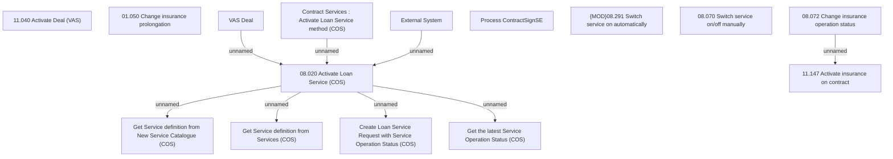

# CSI-2971 Activate Service on Contract

```mermaid
graph TD
    n_11_040_Activate_Deal_VAS["11.040 Activate Deal (VAS)"]
    n_01_050_Change_insurance_prolongation["01.050 Change insurance prolongation"]
    Contract_Services_Activate_Loan_Service_method_COS["Contract Services : Activate Loan Service method (COS)"]
    Get_the_latest_Service_Operation_Status_COS["Get the latest Service Operation Status (COS)"]
    VAS_Deal["VAS Deal"]
    External_System["External System"]
    Create_Loan_Service_Request_with_Service_Operation_Status_CO["Create Loan Service Request with Service Operation Status (COS)"]
    Get_Service_definition_from_Services_COS["Get Service definition from Services (COS)"]
    Get_Service_definition_from_New_Service_Catalogue_COS["Get Service definition from New Service Catalogue (COS)"]
    n_08_020_Activate_Loan_Service_COS["08.020 Activate Loan Service (COS)"]
    Process_ContractSignSE["Process ContractSignSE"]
    MOD_08_291_Switch_service_on_automatically["{MOD}08.291 Switch service on automatically"]
    n_08_070_Switch_service_on_off_manually["08.070 Switch service on/off manually"]
    n_08_072_Change_insurance_operation_status["08.072 Change insurance operation status"]
    n_11_147_Activate_insurance_on_contract["11.147 Activate insurance on contract"]
    VAS_Deal -->|unnamed| n_08_020_Activate_Loan_Service_COS
    Contract_Services_Activate_Loan_Service_method_COS -->|unnamed| n_08_020_Activate_Loan_Service_COS
    External_System -->|unnamed| n_08_020_Activate_Loan_Service_COS
    n_08_020_Activate_Loan_Service_COS -->|unnamed| Get_Service_definition_from_New_Service_Catalogue_COS
    n_08_020_Activate_Loan_Service_COS -->|unnamed| Get_Service_definition_from_Services_COS
    n_08_020_Activate_Loan_Service_COS -->|unnamed| Create_Loan_Service_Request_with_Service_Operation_Status_CO
    n_08_020_Activate_Loan_Service_COS -->|unnamed| Get_the_latest_Service_Operation_Status_COS
    n_08_072_Change_insurance_operation_status -->|unnamed| n_11_147_Activate_insurance_on_contract
```
