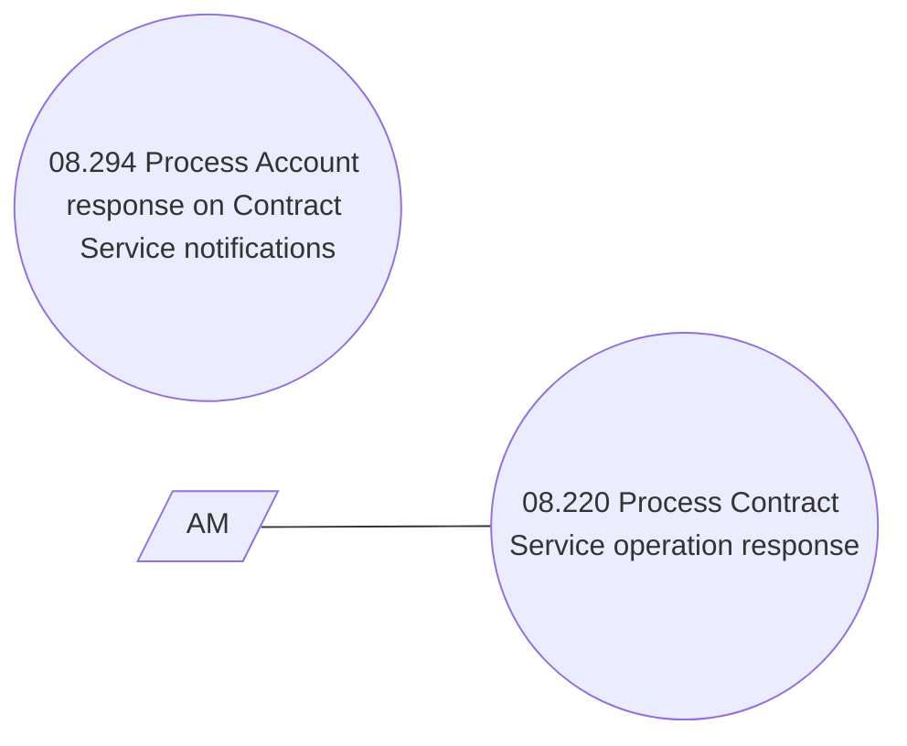

# Process Service operation response

- **Diagram Type**: Use Case
- **Package**: HomerSelect/BSL/Modules/Contract Services (COS_NG)/Requirement Model/CBL-22680 Service Management Modules for REL/CSI-2976 Process Service operation response
- **Diagram ID**: 160159
- **Elements**: 3
- **Connectors**: 1

