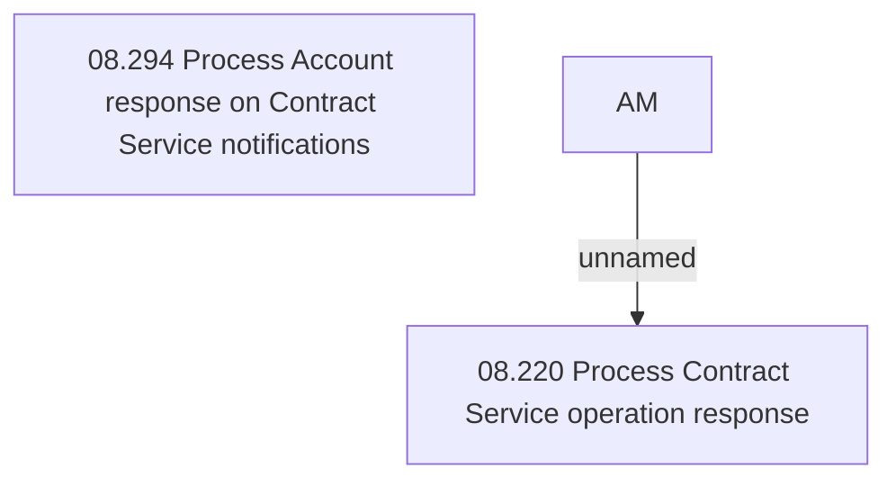

# Process Service operation response

```mermaid
graph TD
    n_08_294_Process_Account_response_on_Contract_Service_notifi["08.294 Process Account response on Contract Service notifications"]
    AM["AM"]
    n_08_220_Process_Contract_Service_operation_response["08.220 Process Contract Service operation response"]
    AM -->|unnamed| n_08_220_Process_Contract_Service_operation_response
```
