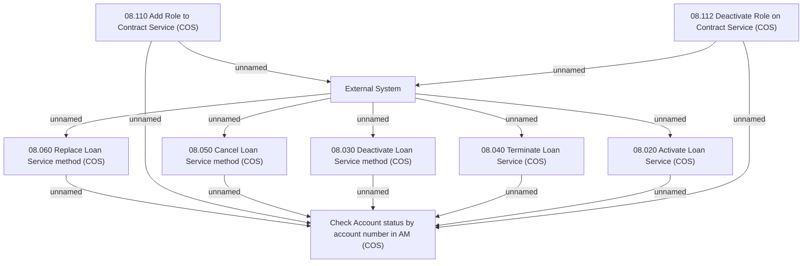

# Contract Service management

```mermaid
graph TD
    Check_Account_status_by_account_number_in_AM_COS["Check Account status by account number in AM (COS)"]
    n_08_112_Deactivate_Role_on_Contract_Service_COS["08.112 Deactivate Role on Contract Service (COS)"]
    n_08_110_Add_Role_to_Contract_Service_COS["08.110 Add Role to Contract Service (COS)"]
    n_08_060_Replace_Loan_Service_method_COS["08.060 Replace Loan Service method (COS)"]
    External_System["External System"]
    n_08_050_Cancel_Loan_Service_method_COS["08.050 Cancel Loan Service method (COS)"]
    n_08_040_Terminate_Loan_Service_COS["08.040 Terminate Loan Service (COS)"]
    n_08_030_Deactivate_Loan_Service_method_COS["08.030 Deactivate Loan Service method (COS)"]
    n_08_020_Activate_Loan_Service_COS["08.020 Activate Loan Service (COS)"]
    External_System -->|unnamed| n_08_020_Activate_Loan_Service_COS
    External_System -->|unnamed| n_08_030_Deactivate_Loan_Service_method_COS
    External_System -->|unnamed| n_08_040_Terminate_Loan_Service_COS
    External_System -->|unnamed| n_08_060_Replace_Loan_Service_method_COS
    External_System -->|unnamed| n_08_050_Cancel_Loan_Service_method_COS
    n_08_060_Replace_Loan_Service_method_COS -->|unnamed| Check_Account_status_by_account_number_in_AM_COS
    n_08_110_Add_Role_to_Contract_Service_COS -->|unnamed| External_System
    n_08_110_Add_Role_to_Contract_Service_COS -->|unnamed| Check_Account_status_by_account_number_in_AM_COS
    n_08_050_Cancel_Loan_Service_method_COS -->|unnamed| Check_Account_status_by_account_number_in_AM_COS
    n_08_030_Deactivate_Loan_Service_method_COS -->|unnamed| Check_Account_status_by_account_number_in_AM_COS
    n_08_040_Terminate_Loan_Service_COS -->|unnamed| Check_Account_status_by_account_number_in_AM_COS
    n_08_020_Activate_Loan_Service_COS -->|unnamed| Check_Account_status_by_account_number_in_AM_COS
    n_08_112_Deactivate_Role_on_Contract_Service_COS -->|unnamed| External_System
    n_08_112_Deactivate_Role_on_Contract_Service_COS -->|unnamed| Check_Account_status_by_account_number_in_AM_COS
```
