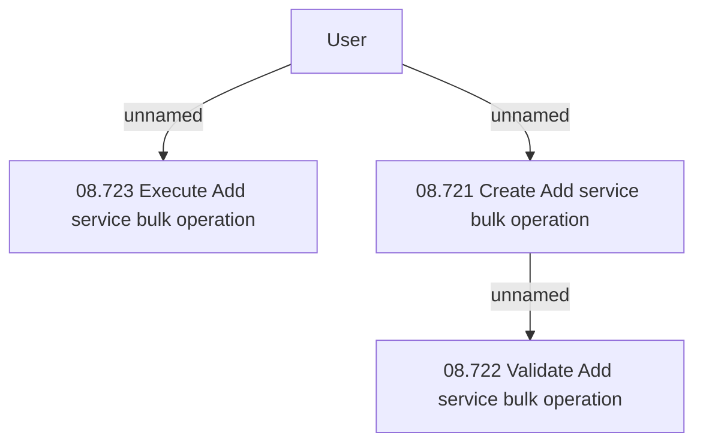

# Use Case Model

```mermaid
graph TD
    User["User"]
    n_08_723_Execute_Add_service_bulk_operation["08.723 Execute Add service bulk operation"]
    n_08_722_Validate_Add_service_bulk_operation["08.722 Validate Add service bulk operation"]
    n_08_721_Create_Add_service_bulk_operation["08.721 Create Add service bulk operation"]
    User -->|unnamed| n_08_721_Create_Add_service_bulk_operation
    n_08_721_Create_Add_service_bulk_operation -->|unnamed| n_08_722_Validate_Add_service_bulk_operation
    User -->|unnamed| n_08_723_Execute_Add_service_bulk_operation
```
