# Use Case Model

- **Diagram Type**: Use Case
- **Package**: HomerSelect/BSL/Modules/Contract bulk operations (BSA)/Analytical Model/COMMON for Contract Bulk Operations/Use Case Model
- **Diagram ID**: 164448
- **Elements**: 11
- **Connectors**: 0

```mermaid
graph LR
    ADD_Process_AccountNotification(("{ADD}Process AccountNotification"))
    ADD_Process_DebtPurchaseNotification(("{ADD}Process DebtPurchaseNotification"))
    Process_ContractServiceNotification(("Process ContractServiceNotification"))
    n_08_706_Get_list_of_subperiods_for_data_export_bulk_operati(("08.706 Get list of subperiods for data export bulk operation"))
    n_08_715_Archive_bulk_operation(("08.715 Archive bulk operation"))
    n_08_701_Search_bulk_operation(("08.701 Search bulk operation"))
    n_08_713_Resume_bulk_operation(("08.713 Resume bulk operation"))
    n_08_712_Pause_bulk_operation(("08.712 Pause bulk operation"))
    n_08_705_Get_list_of_contracts_for_bulk_operation(("08.705 Get list of contracts for bulk operation"))
    MOD_08_711_Execute_bulk_operation(("{MOD}08.711 Execute bulk operation"))
    n_08_702_Get_bulk_operation_detail(("08.702 Get bulk operation detail"))
```

