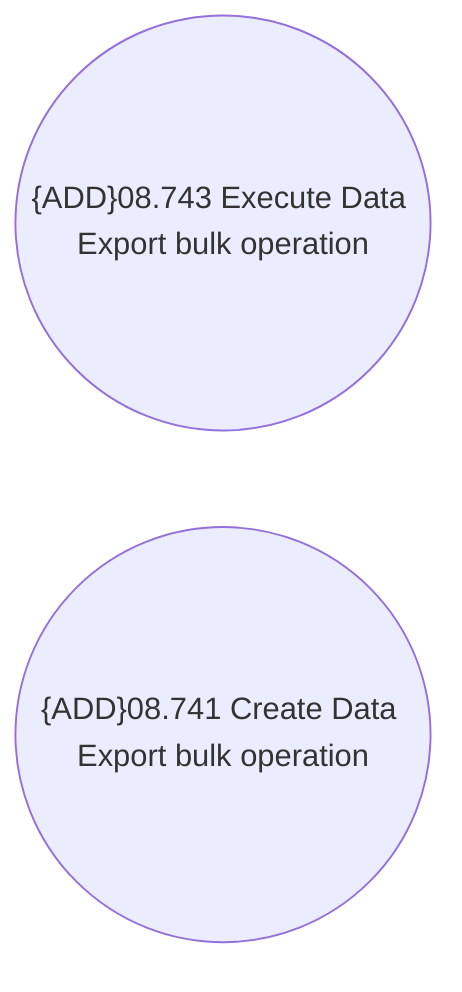

# Use Case Model

- **Diagram Type**: Use Case
- **Package**: HomerSelect/BSL/Modules/Contract bulk operations (BSA)/Analytical Model/Data Export/Use Case Model
- **Diagram ID**: 157731
- **Elements**: 2
- **Connectors**: 0

