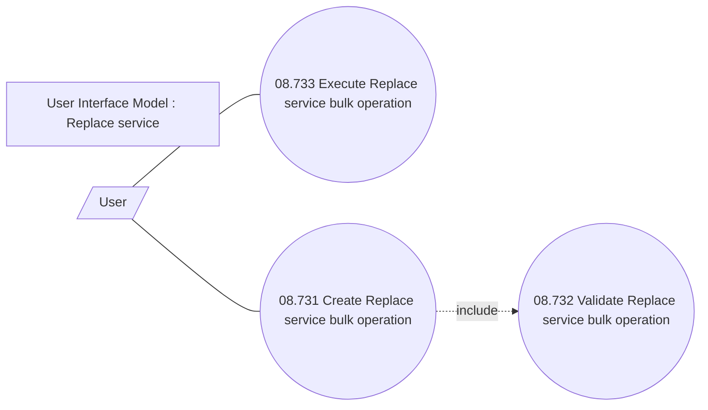

# Use Case Model

- **Diagram Type**: Use Case
- **Package**: HomerSelect/BSL/Modules/Contract bulk operations (BSA)/Analytical Model/Replace service/Use Case Model
- **Diagram ID**: 164412
- **Elements**: 5
- **Connectors**: 3

