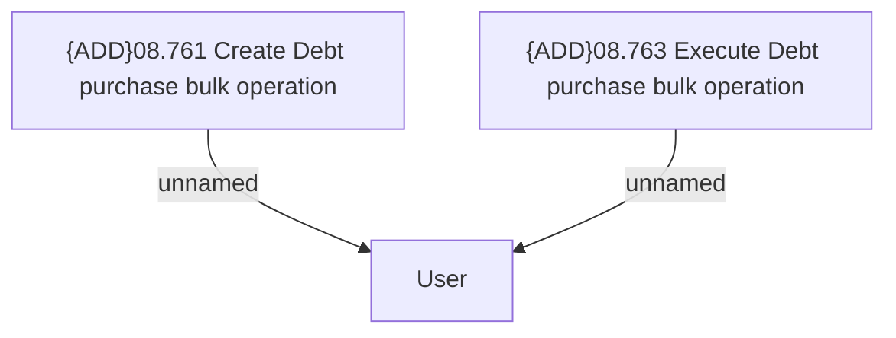

# Use Case Model

```mermaid
graph TD
    User["User"]
    ADD_08_763_Execute_Debt_purchase_bulk_operation["{ADD}08.763 Execute Debt purchase bulk operation"]
    ADD_08_761_Create_Debt_purchase_bulk_operation["{ADD}08.761 Create Debt purchase bulk operation"]
    ADD_08_761_Create_Debt_purchase_bulk_operation -->|unnamed| User
    ADD_08_763_Execute_Debt_purchase_bulk_operation -->|unnamed| User
```
