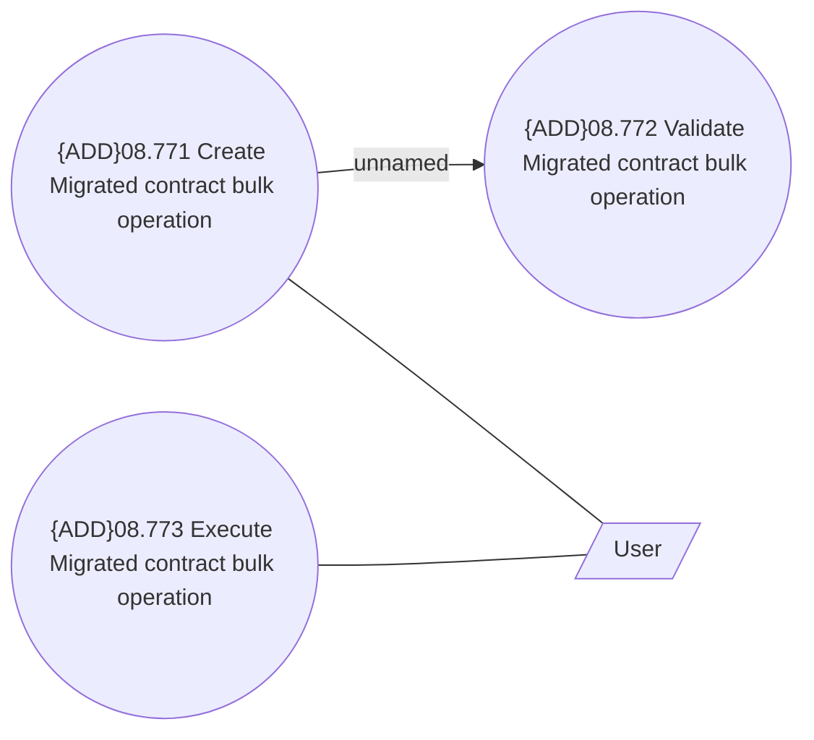

# Use Case Model

- **Diagram Type**: Use Case
- **Package**: HomerSelect/BSL/Modules/Contract bulk operations (BSA)/Analytical Model/{ADD}Migrated contract/Use Case Model
- **Diagram ID**: 164692
- **Elements**: 4
- **Connectors**: 3

