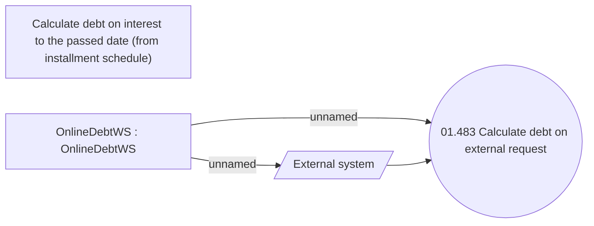

# Calculate debt on external request

- **Diagram Type**: Use Case
- **Package**: HomerSelect/BSL/Modules/Debt catalogue/Analytical Model/UseCase Model
- **Diagram ID**: 164572
- **Elements**: 4
- **Connectors**: 3

