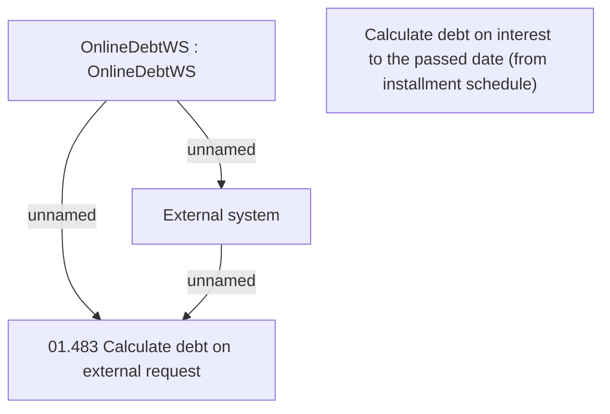

# Calculate debt on external request

```mermaid
graph TD
    n_01_483_Calculate_debt_on_external_request["01.483 Calculate debt on external request"]
    External_system["External system"]
    OnlineDebtWS_OnlineDebtWS["OnlineDebtWS : OnlineDebtWS"]
    Calculate_debt_on_interest_to_the_passed_date_from_installme["Calculate debt on interest to the passed date (from installment schedule)"]
    OnlineDebtWS_OnlineDebtWS -->|unnamed| n_01_483_Calculate_debt_on_external_request
    External_system -->|unnamed| n_01_483_Calculate_debt_on_external_request
    OnlineDebtWS_OnlineDebtWS -->|unnamed| External_system
```
