# Contract debt tracking

- **Diagram Type**: Use Case
- **Package**: HomerSelect/BSL/Modules/Debt catalogue/Analytical Model/UseCase Model
- **Diagram ID**: 164571
- **Elements**: 35
- **Connectors**: 16

```mermaid
graph LR
    UseCase_Model_Contract_signing["UseCase Model : Contract signing"]
    DEL_DPD_statistics_recalculation_job["{DEL}DPD statistics recalculation job"]
    UseCase_Model_Contract_cancellation["UseCase Model : Contract cancellation"]
    n_01_472_Push_debt_catalogue_to_external_system(("01.472 Push debt catalogue to external system"))
    n_01_471_Get_debt_catalogue_for_external_system(("01.471 Get debt catalogue for external system"))
    Collection_system[/"Collection system"/]
    Process_debt_catalogue_requests_job["Process debt catalogue requests job"]
    MOD_01_475_Update_overdue_debt_in_job(("{MOD}01.475 Update overdue debt in job"))
    Debt_Catalog["Debt Catalog"]
    Time[/"Time"/]
    n_01_476_Process_contract_debt_change_request(("01.476 Process contract debt change request"))
    Debt_catalog_values_on_contract_cancellation["Debt catalog values on contract cancellation "]
    Calculation_formulas_Debt_catalogue_calculation_formulas_hie["Calculation formulas : Debt catalogue calculation formulas hierarchy"]
    MOD_01_473_Show_debt_catalogue_detail(("{MOD}01.473 Show debt catalogue detail"))
    Update_Overdue_Debt_job["Update Overdue Debt job"]
    Debt_catalogue_calculation_formula["Debt catalogue calculation formula"]
    n_01_481_Get_debt_statistics(("01.481 Get debt statistics"))
    Events_to_update_CEL_contract_debt["Events to update CEL contract debt"]
    Account_Notifications_Account_Notifications_REL_Account_bala["Account Notifications : Account Notifications - REL Account balance change"]
    CaBus_AM[/"CaBus-AM"/]
    Debt_Catalogue_Debt_full_info_calculations["Debt Catalogue : Debt full info calculations"]
    OnlineDebtWS_OnlineDebtWS["OnlineDebtWS : OnlineDebtWS"]
    n_01_477_Process_debt_catalogue_requests_job(("01.477 Process debt catalogue requests job"))
    n_01_470_Update_contract_debt_catalog(("01.470 Update contract debt catalog"))
    Tab6_Repayment_Tab6_Repayment["Tab6-Repayment : Tab6-Repayment"]
    n_01_486_Calculate_debt_full_info(("01.486 Calculate debt full info"))
    n_01_474_Calculate_CEL_debt_info(("01.474 Calculate CEL debt info"))
    DEL_01_482_Update_debt_statistics(("{DEL}01.482 Update debt statistics"))
    Use_Case_Model_Determine_installment_schedule_processing["Use Case Model : Determine installment schedule processing"]
    UseCase_Model_Contract_finishing_automatically["UseCase Model : Contract finishing automatically"]
    UseCase_Model_Pay_off_contract["UseCase Model : Pay-off contract"]
    Use_Case_Pairing_installment_parts_procedure["Use Case : Pairing installment parts procedure"]
    User[/"User"/]
    n_01_485_Publish_debt_full_info_job(("01.485 Publish debt full info job"))
    Collections_system_interfaces_LCS_interface_DebtNotification["Collections system interfaces : LCS interface - DebtNotificationService"]
    CaBus_AM --> n_01_476_Process_contract_debt_change_request
    Process_debt_catalogue_requests_job -->|unnamed| n_01_477_Process_debt_catalogue_requests_job
    Debt_Catalogue_Debt_full_info_calculations -->|unnamed| n_01_486_Calculate_debt_full_info
    Time --> n_01_485_Publish_debt_full_info_job
    Time --> DEL_01_482_Update_debt_statistics
    CaBus_AM --> n_01_481_Get_debt_statistics
    OnlineDebtWS_OnlineDebtWS -->|unnamed| n_01_481_Get_debt_statistics
    n_01_472_Push_debt_catalogue_to_external_system -->|unnamed| Collections_system_interfaces_LCS_interface_DebtNotification
    Account_Notifications_Account_Notifications_REL_Account_bala -->|unnamed| n_01_476_Process_contract_debt_change_request
    MOD_01_473_Show_debt_catalogue_detail -->|unnamed| Tab6_Repayment_Tab6_Repayment
    User --> MOD_01_473_Show_debt_catalogue_detail
    Time --> n_01_472_Push_debt_catalogue_to_external_system
    OnlineDebtWS_OnlineDebtWS -->|unnamed| n_01_471_Get_debt_catalogue_for_external_system
    Collection_system --> n_01_471_Get_debt_catalogue_for_external_system
    Calculation_formulas_Debt_catalogue_calculation_formulas_hie -->|unnamed| Debt_catalogue_calculation_formula
    Time --- MOD_01_475_Update_overdue_debt_in_job
```

