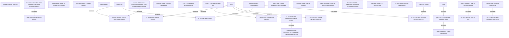

# Contract debt tracking

```mermaid
graph TD
    MOD_01_475_Update_overdue_debt_in_job["{MOD}01.475 Update overdue debt in job"]
    Debt_catalogue_calculation_formula["Debt catalogue calculation formula"]
    Update_Overdue_Debt_job["Update Overdue Debt job"]
    MOD_01_473_Show_debt_catalogue_detail["{MOD}01.473 Show debt catalogue detail"]
    Calculation_formulas_Debt_catalogue_calculation_formulas_hie["Calculation formulas : Debt catalogue calculation formulas hierarchy"]
    Debt_catalog_values_on_contract_cancellation["Debt catalog values on contract cancellation "]
    n_01_476_Process_contract_debt_change_request["01.476 Process contract debt change request"]
    UseCase_Model_Contract_signing["UseCase Model : Contract signing"]
    Debt_Catalog["Debt Catalog"]
    n_01_481_Get_debt_statistics["01.481 Get debt statistics"]
    Process_debt_catalogue_requests_job["Process debt catalogue requests job"]
    Collection_system["Collection system"]
    n_01_471_Get_debt_catalogue_for_external_system["01.471 Get debt catalogue for external system"]
    n_01_472_Push_debt_catalogue_to_external_system["01.472 Push debt catalogue to external system"]
    UseCase_Model_Contract_cancellation["UseCase Model : Contract cancellation"]
    DEL_DPD_statistics_recalculation_job["{DEL}DPD statistics recalculation job"]
    Tab6_Repayment_Tab6_Repayment["Tab6-Repayment : Tab6-Repayment"]
    n_01_474_Calculate_CEL_debt_info["01.474 Calculate CEL debt info"]
    Time["Time"]
    User["User"]
    Use_Case_Pairing_installment_parts_procedure["Use Case : Pairing installment parts procedure"]
    UseCase_Model_Pay_off_contract["UseCase Model : Pay-off contract"]
    UseCase_Model_Contract_finishing_automatically["UseCase Model : Contract finishing automatically"]
    Use_Case_Model_Determine_installment_schedule_processing["Use Case Model : Determine installment schedule processing"]
    DEL_01_482_Update_debt_statistics["{DEL}01.482 Update debt statistics"]
    Events_to_update_CEL_contract_debt["Events to update CEL contract debt"]
    n_01_486_Calculate_debt_full_info["01.486 Calculate debt full info"]
    Collections_system_interfaces_LCS_interface_DebtNotification["Collections system interfaces : LCS interface - DebtNotificationService"]
    n_01_470_Update_contract_debt_catalog["01.470 Update contract debt catalog"]
    n_01_477_Process_debt_catalogue_requests_job["01.477 Process debt catalogue requests job"]
    OnlineDebtWS_OnlineDebtWS["OnlineDebtWS : OnlineDebtWS"]
    Debt_Catalogue_Debt_full_info_calculations["Debt Catalogue : Debt full info calculations"]
    CaBus_AM["CaBus-AM"]
    Account_Notifications_Account_Notifications_REL_Account_bala["Account Notifications : Account Notifications - REL Account balance change"]
    n_01_485_Publish_debt_full_info_job["01.485 Publish debt full info job"]
    CaBus_AM -->|unnamed| n_01_476_Process_contract_debt_change_request
    Process_debt_catalogue_requests_job -->|unnamed| n_01_477_Process_debt_catalogue_requests_job
    Debt_Catalogue_Debt_full_info_calculations -->|unnamed| n_01_486_Calculate_debt_full_info
    Time -->|unnamed| n_01_485_Publish_debt_full_info_job
    Time -->|unnamed| DEL_01_482_Update_debt_statistics
    CaBus_AM -->|unnamed| n_01_481_Get_debt_statistics
    OnlineDebtWS_OnlineDebtWS -->|unnamed| n_01_481_Get_debt_statistics
    n_01_472_Push_debt_catalogue_to_external_system -->|unnamed| Collections_system_interfaces_LCS_interface_DebtNotification
    Account_Notifications_Account_Notifications_REL_Account_bala -->|unnamed| n_01_476_Process_contract_debt_change_request
    MOD_01_473_Show_debt_catalogue_detail -->|unnamed| Tab6_Repayment_Tab6_Repayment
    User -->|unnamed| MOD_01_473_Show_debt_catalogue_detail
    Time -->|unnamed| n_01_472_Push_debt_catalogue_to_external_system
    OnlineDebtWS_OnlineDebtWS -->|unnamed| n_01_471_Get_debt_catalogue_for_external_system
    Collection_system -->|unnamed| n_01_471_Get_debt_catalogue_for_external_system
    Calculation_formulas_Debt_catalogue_calculation_formulas_hie -->|unnamed| Debt_catalogue_calculation_formula
    Time -->|unnamed| MOD_01_475_Update_overdue_debt_in_job
```
