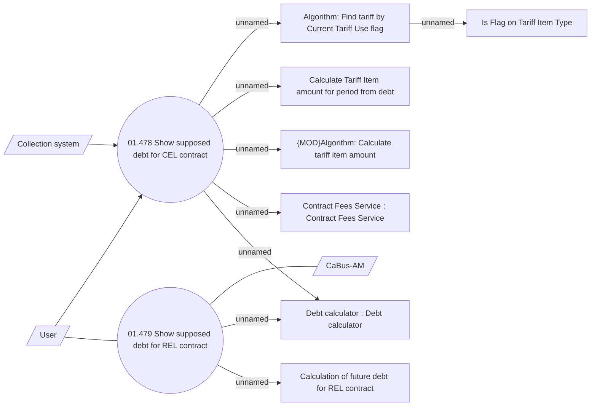

# Debt calculator

- **Diagram Type**: Use Case
- **Package**: HomerSelect/BSL/Modules/Debt catalogue/Analytical Model/UseCase Model
- **Diagram ID**: 164573
- **Elements**: 12
- **Connectors**: 12

